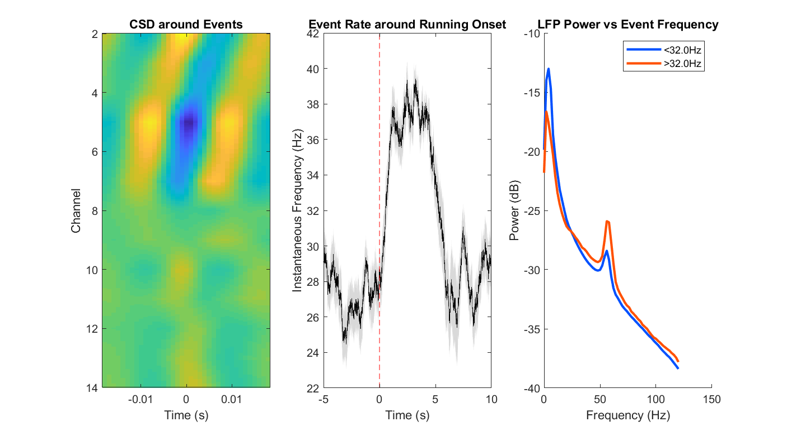

CBASS (Clustering Band-limited Activity by State and Spectro-temporal features)
==========

.. currentmodule:: method_description

**Warning**: Equations will not be visible on a dark background.

LFP power often increases in a specific frequency band during specific events or behavioral states. For example, in the visual cortex of mouse, beta (15-30Hz) increases during visual stimulation while gamma (30-80Hz) increases during running (Fig. 1). 

This is often interpreted as an increase in sustained oscillatory activity. However, due to the stochastic nature of neuronal dynamics, we reasoned that this might reflect a higher occurrence of discrete bouts of patterned activity (i.e. events) having energy in that frequency band. To test this idea and uncover the network dynamics underlying these events, we developed a method capable of detecting them in the time domain. This method, called _**C**lustering **B**and-limited **A**ctivity by **S**tate and **S**pectro-temporal feature_ (**CBASS**), takes advantage of laminarly distributed multichannel LFP recordings to identify spatio-temporal motifs of LFP activity across channels. This identification is based on 2 criteria: **1)** motifs have energy in the frequency band of interest and **2)** their occurrence increases during the selected behavioral state. 
The method can be divided into 3 steps 
1. **extraction**, where a set of candidate events is obtained from multichannel LFP recordings in the frequency band of interest 
2. **probability scoring**, where we compute a score reflecting the probability of each candidate event to occur during the state of interest based on spectro-temporal features
3. **thresholding**, where find a partition between high and low score events that maximize their distance in the spectro-temporal feature space
	
## Extraction
The first step of CBASS extracts candidate network events in the selected frequency band and represents them in a parametric space. Each channel of the LFP (Fig. 2 left) is band-pass filtered in the frequency band of interest (Fig. 2 center). In our case, we used zero-phase digital filtering with a 2nd order Butterworth filter (Matlab functions ``filtfilt`` and ``butter`` or their corresponding functions in the Scipy package). Then, we compute the analytical representation of the filtered signal (Matlab function ``hilbert`` or the corresponding function in Scipy). The analytic representation of a real signal :math:`s(t)` is a complex sequence :math:`s_a(t)` given by :math:`s_{a}(t) = s(t) *2B i*H[s(t)]`

where :math:`H[s(t)]` is the Hilbert transform of :math:`s(t)`. Thus, the real part of the analytical signal is the signal itself and its imaginary part is given by its Hilbert transform. For a band limited time series like the filtered LFP, :math:`s(t)` has the very useful properties that its norm and complex argument respectively correspond to the instantaneous amplitude envelope and instantaneous phase of :math:`s(t)` (the norm can be computed with the Matlab function ``abs`` and the complex argument with the function ``angle``. Corresponding functions can be found in the Numpy package). Thus, the analytical signal gives a rich representation of LFP activity at the band of interest and eliminates frequency redundancy problems related to the Fourier transform [1].

![Fig. 2 - Selection of Candidate Events]

To constrain this representation and make it more amenable to clustering, we select the time points (i.e events) corresponding to the trough of band passed activity in a reference channel (Fig. 2 center), troughs are the time points where the argument of the analytical signal -i.e. the phase is :math:`\pi`-valued). Each event is then represented in a parametric space where parameters correspond to the real and imaginary parts of the analytic signal in each channel. Thus, the position of each event in this parametric space gives information about the amplitude and phase of LFP in each channel at the time of troughs in the reference. This offers a comprehensive but constrained representation of the propagation of LFP activity across channels in the band of interest. In our case, the reference was chosen as the channel closest to 400µm of cortical depth (i.e. layer IV, Fig. 2 center - red channel). Different choices of reference did not affect the qualitative outcome of the procedure but resulted in motifs being shifted in time reflecting the propagation of activity between channels. To follow usual conventions in clustering, we designate the data matrix containing the position of each event in the parametric space as :math:`X`. Each element :math:`X_{i, j}` corresponds to the value of parameter:math:`j` r event :math:`i` (Fig. 3).

## Probability scoring
We then seek to estimate how likely it is for an event to fall in a region of :math:`X`.  where the state of interest happens more than by chance. :math:`X`  can be conceived as a manifold in a parametric space (Fig. 4 left). Our goal is thus to map variations in the probability of occurrence of the selected state over this manifold. To achieve this, we repeat the following steps
1. The manifold is first partitioned into an arbitrary number k of clusters using the initialization step of the k-means algorithm . Briefly k centers are drawn at random from the events in :math:`X`. All events are then grouped according to which center lies closest to them. These cluster can be thought of as non-overlapping regions of the feature space.
2. We then compute the rate :math:`r`. of events occurring during the state of interest in each cluster and compared to :math:`r_{all}` (i.e. the rate over all events in :math:`X`) using a binomial test of order one. Clusters are considered significantly enriched if :math:`r`. was above :math:`r_{all}`.  and the binomial test's p-value is under 0.0001. 

After repeating these step a sufficient number of time (typically 1000 or higher), we compute the enrichment score :math:`s(i)` as the fraction of iterations element :math:`i` was assigned to a cluster where state occurrence was higher than chance. This produces a smooth distribution of score values over the feature space (Fig. 4 center). The number of clusters used has a small but noticeable impact on the result of this procedure. Lower cluster number will produce more smoothing. Conversely, higher cluster numbers will produce distributions having higher entropy at the expense of slower computation time. In our hands, any number between 5 and 100 clusters is acceptable and all give comparable results (Fig. 7; see section potential caveats below for discussion). When needed for visualization or illustration of the different step of the procedure, projections of the X manifold to a low dimension space (2D or 3D) are obtained via dimensionality reduction with UMAP[2, 3] or PHATE[4].

	
## Thresholding
The last step of CBASS seeks to partition a group of events having homogeneous spectro-temporal features and a high probability of occurring during the state of interest (Fig. 4 right). To achieve this, we find the threshold value of s(i) that maximizes the following quantity:

.. math:: T = d_{CC} / \sqrt{1 / N_{low} %2B 1 / N_{up}}

where :math:`d_{CC}` is the Mahalanobis distance between centroids above and under threshold and :math:`N_{low}` and :math:`N_{up}` are the number of events under and above threshold. :math:`T` can be thought of as an analog of the student _t_ statistics in multidimensional spaces. Here, searches of the value of :math:`s(i)` maximizing :math:`T` are implemented using the simplex method (Matlab function ``fminsearch`` or the Scipy function ``fmin``). 

## Appendix - Generation of surrogate data
To estimate chance level for event detection, CBASS generates surrogate data having the same covariance matrix and the same spectral density in each channel as the original signal (Fig. 5). The LFP is first decomposed into principal components (Matlab function ``pca`` or corresponding function in the Sklearn package). We then compute the Fourier transform of each principal component (Matlab function ``fft`` or corresponding in Scipy). The phase of the transform of each principal component is then randomized and a real signal is reconstituted using the inverse Fourier transform (Matlab function ``ifft`` or corresponding in Scipy). Finally phase randomized principal components are remixed using the principal components loading. This procedure preserves LFP statistics while randomizing spatio-temporal patterns of propagation across channels (Fig. 5).

# Validation
The significance of CBASS's output can be evaluated by comparison to its output on surrogate data (see Generation of surrogate data). We implemented two statistical tests. First, the distribution of enrichment scores between real and surrogate data is compared using the Kolmogorov-Smirnov (KS) test (Matlab function ``kstest2`` or the Scipy function ``ks_2samp``). Failure to pass this test indicates that spectro-temporal feature do not yield more information about the occurrence of the state than expected by chance. Second, we calculate the proportion of event in surrogate data falling over the enrichment score threshold. This can be seen as a p-value representing how likely it is for events to be detected when spectro-temporal features do not give information about state occurrence.
In the visual cortex of awake mice, we found CBASS to be effective at detecting band specific activity motifs evoked by visual stimulation in the beta range (15-30Hz) and by locomotion in the gamma range (30-80Hz). Current Source Density analysis (CSD) revealed that state enriched events are associated to specific current sink patterns across cortical layers (Fig. 6 left). The frequency of occurrence of the motifs increases during the selected state (Fig 6. center). Finally, spectra acquired when the frequency of occurrence of the motif is high (Fig. 6 right) look highly similar to spectra evoked by the selected state for each type of activity (Fig. 1).

## Potential caveats - optimizing cluster number for probability estimation
To estimate state occurrence probability based on features, CBASS partitions a set of band specific events into an arbitrary number of clusters (see section Probability scoring above). This segmentation is repeated to produce a smooth probability distribution of the state of occurrence over events based on spectro-temporal dynamics. Lower cluster numbers will result in more smoothing whereas higher number will tend to produce more contrasted distributions. If the number of clusters is not high enough the procedure might fail to detect small regions where state probability is high. Choosing a number that is too high on the other hand, will increase computation times. In our hand the output of the method is very robust to changes in cluster number (Fig. 7). However, Applying CBASS might require testing an increasing number of clusters for the kind of problem that is meant to be addressed. We advise to choose the minimal number of clusters yielding a stable result.

# Reference
1. Marple, Lawrence. Computing the disrcete-time analytic signal via FFT. IEEE Transactions on signal processing 47, no. 9 (1999) 2600-2603.
2. Becht, E. et al. Dimensionality reduction for visualizing single-cell data using UMAP. Nat. Biotechnol. 37, 38–44 (2019).
3. McInnes, L., Healy, J. & Melville, J. UMAP Uniform Manifold Approximation and Projection for Dimension Reduction. (2018).
4. Moon, K. R. et al. Visualizing structure and transitions in high-dimensional biological data. Nat. Biotechnol. 37, 1482–1492 (2019).

Suppose we want to solve the integro-differential equation (IDE)

.. math::

    \frac{dy}{dx} & = y(x) - \frac{x}{2} + \frac{1}{1 + x} - \ln(1 + x) + \frac{1}{\left(\ln(2)\right)^2} \int_0^1 \frac{x}{1 + s} \, y(s) \, ds, \\
    & x \in [0, 1], \quad y(0) = 0.

The analytic solution to this IDE is :math:`y(x) = \ln(1 + x)`.
We'll find a numerical solution using IDESolver and compare it to the analytic solution.

The very first thing we need to do is install IDESolver.
You'll want to install it via `pip` (`pip install idesolver`) into a `virtual environment <https://docs.python.org/3/tutorial/venv.html>`_.

Now we can create an instance of :class:`IDESolver`, passing it information about the IDE that we want to solve.
The format is

.. math::

   \frac{dy}{dx} & = c(y, x) + d(x) \int_{\alpha(x)}^{\beta(x)} k(x, s) \, F( y(s) ) \, ds, \\
   & x \in [a, b], \quad y(a) = y_0.

so we have

.. math::

    a &= 0 \\
    b &= 1 \\
    y(a) &= 0 \\ \\
    c(x, y) =& y(x) - \frac{x}{2} + \frac{1}{1 + x} - \ln(1 + x) \\
    d(x) =& \frac{1}{\left(\ln(2)\right)^2} \\
    k(x, s) =& \frac{x}{1 + s} \\
    f(s) &= y(s) \\ \\
    \alpha(x) =& 0 \\
    \beta(x) =& 1.

In code, that looks like (using ``lambda`` functions for simplicity):

::

    import numpy as np

    from idesolver import IDESolver

    solver = IDESolver(
        x = np.linspace(0, 1, 100),
        y_0 = 0,
        c = lambda x, y: y - (.5 * x) + (1 / (1 + x)) - np.log(1 + x),
        d = lambda x: 1 / (np.log(2)) ** 2,
        k = lambda x, s: x / (1 + s),
        f = lambda y: y,
        lower_bound = lambda x: 0,
        upper_bound = lambda x: 1,
    )

To run the solver, we call the ``solve()`` method:

::

    solver.solve()

    solver.x  # whatever we passed in for x
    solver.y  # the solution y(x)

The default global error tolerance is :math:`10^{-6}`, with no maximum number of iterations.
For this IDE the algorithm converges in 40 iterations, resulting in a solution that closely approximates the analytic solution, as seen below.

::

    import matplotlib.pyplot as plt

    fig = plt.figure(dpi = 600)
    ax = fig.add_subplot(111)

    exact = np.log(1 + solver.x)

    ax.plot(solver.x, solver.y, label = 'IDESolver Solution', linestyle = '-', linewidth = 3)
    ax.plot(solver.x, exact, label = 'Analytic Solution', linestyle = ':', linewidth = 3)

    ax.legend(loc = 'best')
    ax.grid(True)

    ax.set_title(f'Solution for Global Error Tolerance = {solver.global_error_tolerance}')
    ax.set_xlabel(r'$x$')
    ax.set_ylabel(r'$y(x)$')

    plt.show()

.. image:: /_static/figs/quickstart_comparison.*

::

    fig = plt.figure(dpi = 600)
    ax = fig.add_subplot(111)

    error = np.abs(solver.y - exact)

    ax.plot(solver.x, error, linewidth = 3)

    ax.set_yscale('log')
    ax.grid(True)

    ax.set_title(f'Local Error for Global Error Tolerance = {solver.global_error_tolerance}')
    ax.set_xlabel(r'$x$')
    ax.set_ylabel(r'$\left| y_{\mathrm{idesolver}}(x) - y_{\mathrm{analytic}}(x) \right|$')

    plt.show()

.. image:: /_static/figs/quickstart_error.*
